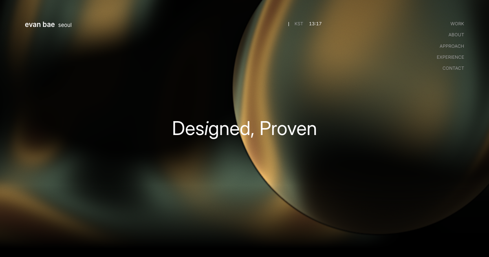

# Portfolio

**Evan Bae · Software engineering & system design**

A personal portfolio for my work in software engineering, system design, and product development.

[Visit the portfolio](https://evanbae.vercel.app/) · [Read the blog](https://evanbae-blog.pages.dev/)



## What is inside

- Selected projects, including Premind, Hailens, and Dusk.
- An interactive Three.js glass-sphere backdrop and animated hero.
- Responsive layouts, scroll animations, and a live Seoul clock.
- Background, experience, and contact information.

## Run locally

This is a static site built with HTML, CSS, and JavaScript. No package installation or build step is required. With Python 3 installed, run from the repository root:

```sh
python3 -m http.server 8000
```

Open [localhost:8000](http://localhost:8000). An internet connection is needed for the external fonts and Three.js modules.

## Code map

| Path | Purpose |
| --- | --- |
| `index.html` | Page content, metadata, and sections |
| `variables.css` | Design tokens |
| `assets/css/main.css` | Layout and styling |
| `assets/js/hero3d.js` | Three.js backdrop |
| `assets/js/iridescence.js` | Hero canvas effect |
| `assets/js/main.js` | Page interactions |

## Implementation notes

The content and design are kept in a small static codebase. The visual backdrop uses browser graphics while the portfolio text remains regular HTML. The repository includes link-preview metadata and an Open Graph image, and the site is deployed on Vercel.
